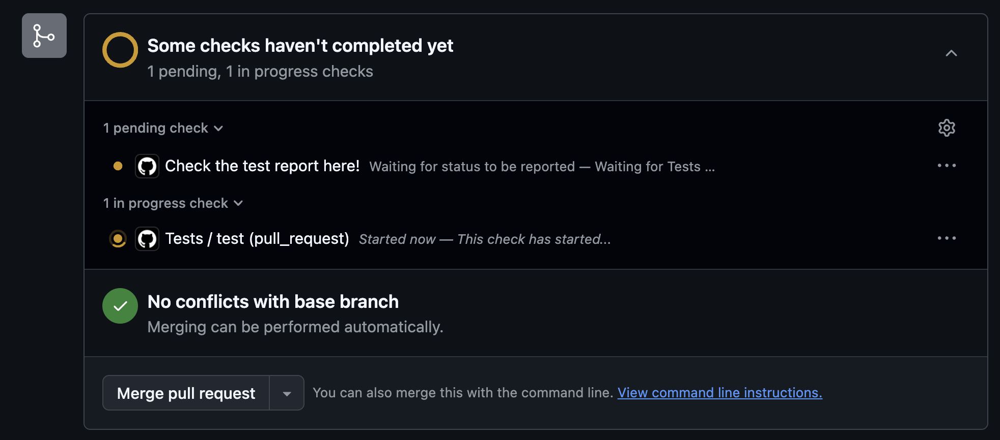
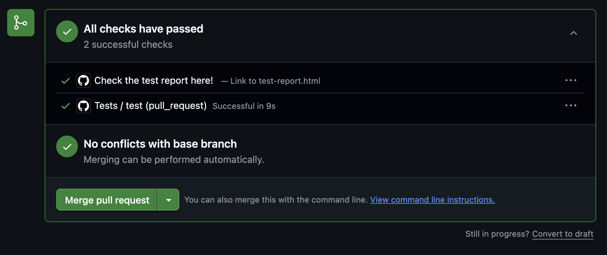
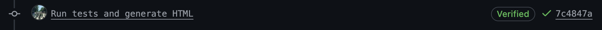
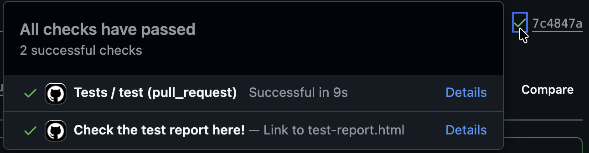
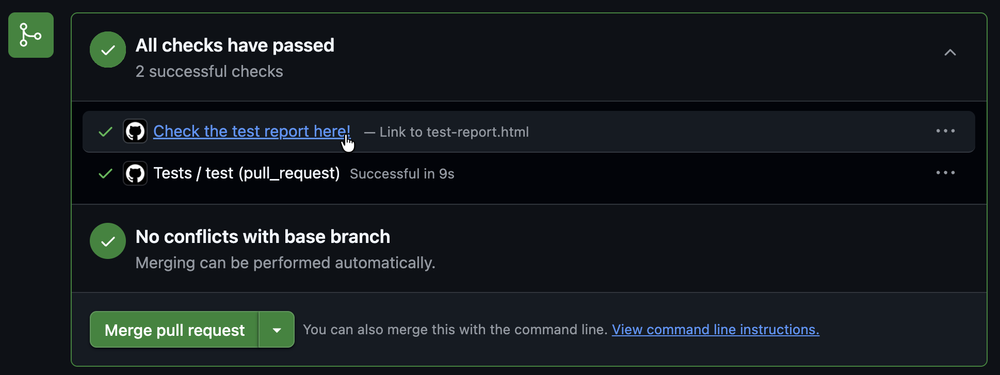
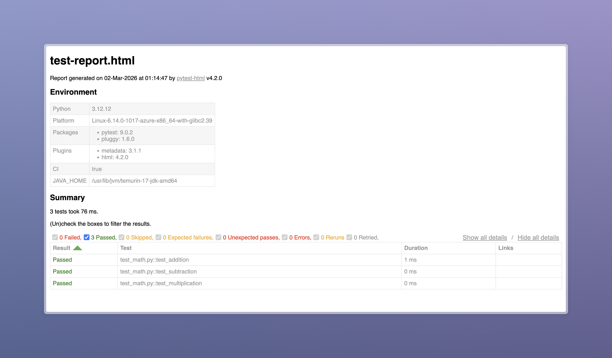

# github-actions-artifacts-redirector-action

This is a GitHub Action to add a GitHub CI job status link directly to a GitHub Actions artifact.

When a build workflow uploads an artifact, this action will create a named entry in the checks list for a pull request, and in a corresponding commit, whose **Details** link opens the artifact directly in your browser. This is possible to the new [`upload-artifact@v7`](https://github.com/actions/upload-artifact/releases/tag/v7.0.0) release and its `archive: false` input, with which single-file artifacts (HTML docs previews, coverage reports, images) can be rendered directly without downloading an archive and extracting it.

## Security note

> [!IMPORTANT]
> Static analysis tools for GitHub Actions, such as [Zizmor](https://zizmor.sh/), will flag this action for responding to the `workflow_run` event (see https://docs.zizmor.sh/audits/#dangerous-triggers). However, this trigger is required for this redirector to work, as it is the only mechanism GitHub provides for one workflow to react to the completion of another workflow and get URL(s) to its generated artifact(s). That being said, this action is safe to use in your repository:
>
> 1. **No untrusted code is checked out or executed.** The recommended redirector workflow below, i.e., the one that uses `workflow_run`, never checks out PR code, and it only runs the published action from a tagged release here.
> 2. **The artifact content is never downloaded or evaluated.** The action calls the GitHub REST API to read artifact _metadata_ (name and ID) and constructs a URL. It never downloads, parses, or executes the contents of the artifact.
>
> To suppress the Zizmor finding, you may add an inline ignore comment in your redirector workflow:
>
> ```yaml
> on: # zizmor: ignore[dangerous-triggers]
>   workflow_run:
> ```
>
> However, please ensure that you **must not** check out or execute any untrusted code in the redirector workflow, or any sensitive post-processing steps. The security of this pattern depends on the redirector workflow remaining a thin API wrapper, and being limited to running this action.
>
> Please feel free to reach out via a GitHub issue if you have any security concerns or suggestions.

## Usage

### 1. Configure your build workflow (which uploads the artifact)

For example, this is a self-contained HTML test report generated by [`pytest-html`'s `--self-contained-html` option](https://pypi.org/project/pytest-html/) and uploaded with `upload-artifact@v7` + `archive: false`:

```yaml
# .github/workflows/tests.yml
name: Test Suite

on: [pull_request, push]

jobs:
  test:
    runs-on: ubuntu-latest
    steps:
      - uses: actions/checkout@v6
        with:
          persist-credentials: false
      - uses: actions/setup-python@a309ff8b426b58ec0e2a45f0f869d46889d02405 # v6.2.0
        with:
          python-version: "3.12"
      - run: pip install pytest pytest-html
      - run: pytest --html=test-report.html --self-contained-html

      # use `upload-artifact@v7` or later with `archive: false` for a
      # browser-viewable single file. The `if: always()` check ensures
      # the report is uploaded even when tests fail.
      is uploaded even when tests fail
      - uses: actions/upload-artifact@bbbca2ddaa5d8feaa63e36b76fdaad77386f024f # v7.0.0
        if: always()
        with:
          path: test-report.html
          archive: false
          # N.B. With archive: false, `name` is ignored.
          # The artifact name becomes the filename: "test-report"
```

### 2. Add a redirector workflow (that creates the status link)

> [!NOTE]
> GitHub Actions always runs the `workflow_run` workflow from the context of the **default branch**, not from the PR branch. Therefore, any changes to this file must be merged to your default branch before they take effect.

```yaml
# .github/workflows/test_report_redirect.yml
name: View test report here

on:
  workflow_run:
    # must match the build workflow's `name:` exactly, i.e., "Test Suite", and
    # not "tests", or any other variation
    workflows: ["Test Suite"]
    # or just `completed`, if you would only want it to show up after
    # "Test Suite" completes and not when it is pending/in progress.
    types: [requested, in_progress, completed]

permissions: {}

jobs:
  github_artifacts_redirector_job:
    runs-on: ubuntu-latest
    permissions:
      statuses: write
      actions: read
    steps:
      - uses: agriyakhetarpal/github-actions-artifacts-redirector-action@683d25ace2cb0aefe8e6719c39c2ac7f3d22dd8c # v1.0.0
        id: redirect
        with:
          repo-token: ${{ secrets.GITHUB_TOKEN }}
          artifact-name: test-report # matches the uploaded filename (without .html)
          job-title: Check the test report here!

      - name: Check the URL
        run: echo "${{ steps.redirect.outputs.url }}"
```

## Screenshots

For a visual example, here are a few screenshots of what the above configuration looks like in practice:

<details>
<summary>Tap to expand</summary>

1.  When the workflows are added and configured, the PR checks list shows the redirector job with a pending status, while the workflow that uploads the artifact (in this case, "Tests") is in progress:
    

2.  When the workflow that uploads the artifact completes, the redirector job's status updates accordingly:
    
    - 2.1. You may also view the same via the indicator next to the latest pushed commit:
      
    - 2.2. If you click on it, you will see the redirector job in the checks list, and clicking on its "Details" link will open the artifact directly in your browser if it is a supported MIME type.
      

3.  When you click on the redirector job's "Details" link or the "Check the test report here!" link in the checks list, you will be taken directly to the artifact in your browser, without needing to download and extract it first:
    

4.  This is how the artifact appears. In this case, it is an HTML report generated by `pytest-html` with the `--self-contained-html` option, which includes all CSS and JS inline and can be rendered directly by the browser without needing to download and extract any additional files: <br><br>
    

</details>

## Inputs

| Input           | Required | Default                      | Description                                                                                                                                                                                                      |
| --------------- | -------- | ---------------------------- | ---------------------------------------------------------------------------------------------------------------------------------------------------------------------------------------------------------------- |
| `repo-token`    | ✅       | —                            | `${{ secrets.GITHUB_TOKEN }}`                                                                                                                                                                                    |
| `artifact-name` |          | `""`                         | Name of the artifact to link to. For `upload-artifact@v7` with `archive: false`, this is the filename without extension. For v4/v5/v6 this is the `name:` you passed. If omitted, uses the first artifact found. |
| `job-title`     |          | `"<workflow name> artifact"` | Label shown in the PR checks list                                                                                                                                                                                |

## Outputs

| Output | Description                                                                                                     |
| ------ | --------------------------------------------------------------------------------------------------------------- |
| `url`  | The direct URL to the artifact (set when the workflow run completed and an artifact was found, even on failure) |

## Some notes and caveats

- The `workflow_run` trigger fires for the **default branch**'s version of the redirector workflow, even when the build workflow is triggered by a PR from a fork.

- You should include all three `types: [requested, in_progress, completed]` if you want to get the live pending, success/failure status progression in the checks UI. If you only use `completed`, the check appear only after the build is done and passed.

- The `statuses: write` permission is required to call `createCommitStatus`. The `actions: read` permission is required to list artifacts for the triggering run.

- The `archive: false` feature only supports single files right now. I can look into supporting multiple files and folders in the future if GitHub adds support for doing so.

- Artifacts expire, and so will the commit status URL. If you need long-lived links, please consider using GitHub Pages or GitHub Releases.

## Contributing

Please make any changes to `index.js` and open a PR. Changes will automatically be
compiled into `dist/index.js` by the [autofix.ci bot](https://autofix.ci/).

Alternatively, if you want to rebuild locally:

```bash
npm install
npm run package
```

Any other changes (documentation, workflows, tests, etc.) are welcome as well. Thank you for your interest in improving this project! 🙌

## Thanks

- https://github.com/scientific-python/circleci-artifacts-redirector-action, where I got this idea from, and whose code I referred to when writing this action. This GitHub Action is a similar redirector but for GitHub Actions artifacts instead of CircleCI artifacts, and it uses the `workflow_run` trigger instead of `status`, as the latter is available for Apps such as CircleCI.
- The GitHub Actions contributors and team, for adding [the `archive: false` option](https://github.com/actions/upload-artifact/pull/764/) to `upload-artifact@v7` and the proxy URLs that make browser-viewable artifacts for supported MIME types work.
